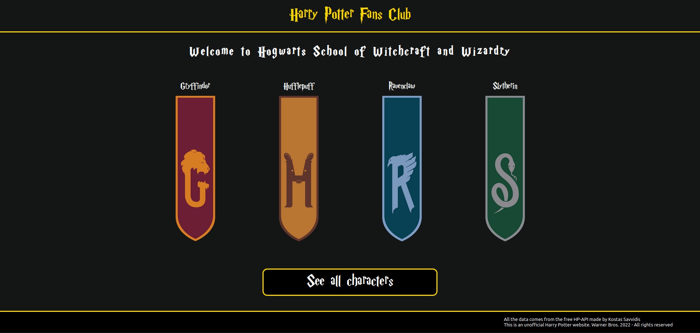
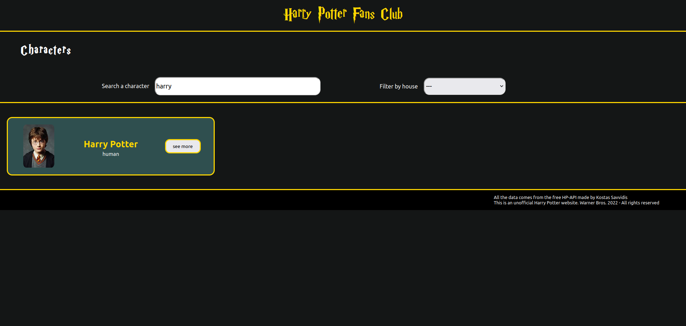
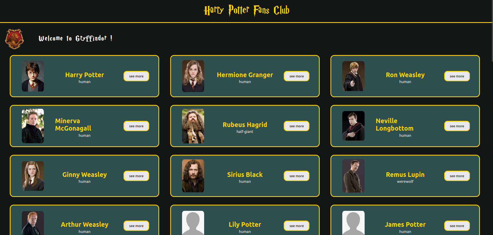

# Harry Potter Fan Club

Ce projet est un exercice à destination des développeurs juniors souhaitant progresser en React.

## Objectifs

Créer une one page app en React avec React Router Dom.

- Page `Home` qui permet de naviguer entre les pages de personnages et de maisons
- Page `House` qui présente la liste des maisons de Harry Potter
- Page `CharacterList` qui affiche la liste de tous les utilisateurs avec un champ de recherche
- Page `CharacterDetails` qui présente le détail d'un personnage

> Conseils : Pensez à séparer les fetch dans des fichiers spécifiques.

## Screenshots

Ces images sont fournies à titre indicatif pour vous permettre de mieux comprendre l'objectif de cet exercice

## Ressources

Vous allez utiliser l'API suivante : https://hp-api.onrender.com

Pour récupérer les personnages : `/api/characters`

Pour récupérer les personnages en fonction de leur maison : `/api/characters/house/:house`

## Remerciement

Ce projet est basé sur le projet de [Jordann Le Gal](https://github.com/Nnadroj). Merci à lui pour sa contribution.
